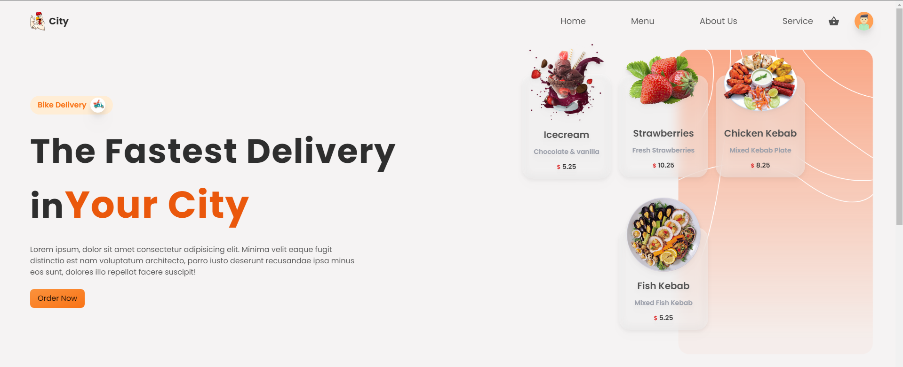
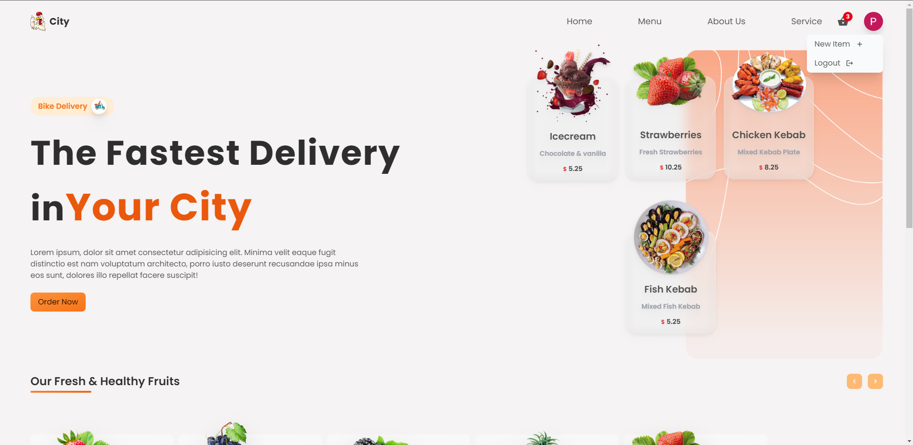
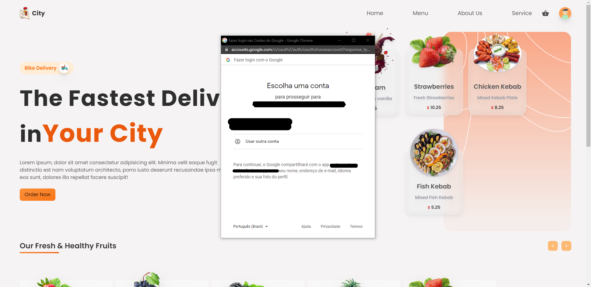
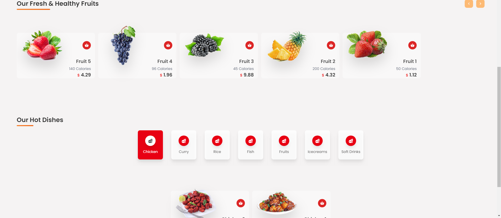
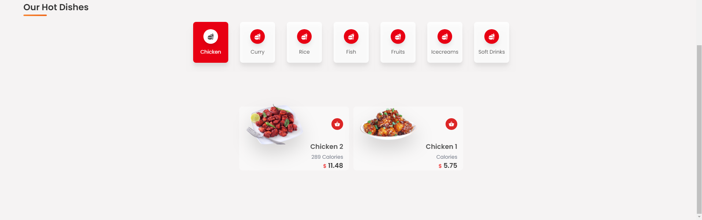
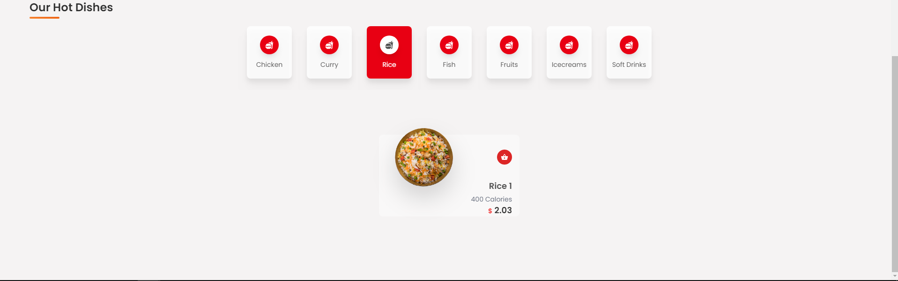
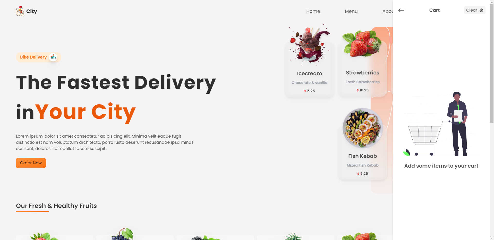
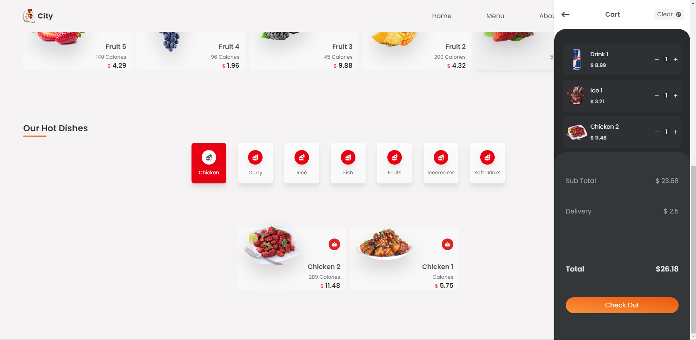
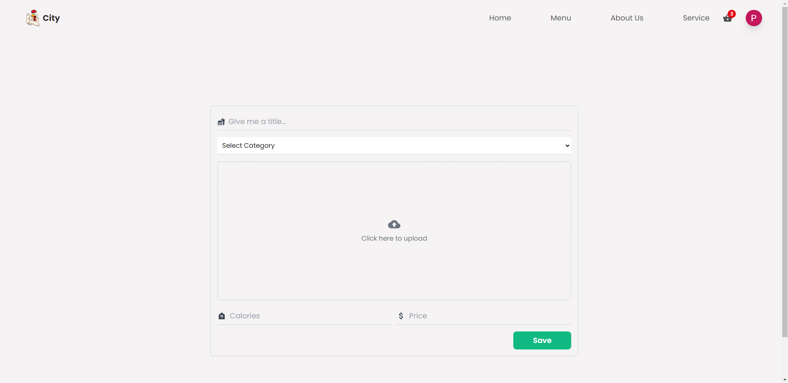
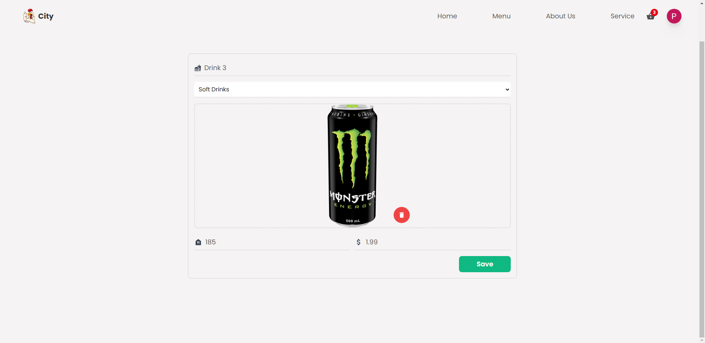

# DELIVERY APP

# Sobre o projeto

Aplicação web de um delivery de comida. Com carrinho de compras, autenticação, sessão de frutas e lista dinâmica de items. 

### Explicação do sistema

- Na sessão inicial da aplicação contem uma explicação do delivery e exemplos dos produtos do estabelecimento

- No cabeçalho existe quatro opções que faz a página se direcionar a posição da respectiva sessão(não implementado), contém o carrinho 
de compras e um icone para realizar a autenticação pelo google autenticador

- A proxima sessão são das frutas que constam no banco de dados

- Por último uma sessão que apresenta opções dos tipos de pratos e quando clicado tras os resultados na tela com informações sobre os produtos

#### Usuário administrador

- O usuário administrador pode acessar a página de cadastro de produtos

### Tela inicial


### Menu dropdown


### Autenticação Google


### Sessão de frutas


### Sessão de pratos(selecionado pratos com frango)


### Sessão de pratos(selecionado pratos com arroz)


### Carrinho de compras vazio


### Carrinho de compras com produtos


### Cadastro de produtos


### Cadastro de produtos pronta para o envio


# 🚀 Começando

Essas instruções permitirão que você obtenha uma cópia do projeto em operação na sua máquina local para fins de desenvolvimento e teste.

## 📋 Pré-requisitos

- npm / yarn
- cadastro no firebase

## 🔧 Instalação
### :warning::warning: **A pasta images**: é para guardar as imagens usadas no readme.md! Apagar ela depois do clone :warning::warning:

``` bash
## firebase
- cadastrar no firebase
- habilitar a storage
- habilitar o autenticador
- habilitar o firestoredatabase
- em storage criar um diretório com o nome imagens

## firebase credentials
- em configurações copie as credenciais fornecidas pelo firebase

## clonar repositório
git clone https://github.com/PauloCSantos/deliveryApp.git

## no diretório utils
- abrir o arquivo firebaseCred.txt
- trocar o arquivo para .js
- preencher com as credenciais 

## entrar na pasta do projeto
cd deliveryApp

## instalar as dependencias
npm i

## executar o projeto
npm start
```

## 🛠️ Construído com

- ReactJs
- Firebase
- Tailwindcss
- Framer motion

## ✒️ Autor

* **Paulo C Santos** - [Linkedin](https://www.linkedin.com/in/paulocsantos1995/)

## 🖐️ Agradecimento

Agradeço ao canal Vetrivel Ravi pela aula

- Link do canal: https://www.youtube.com/c/VetrivelRavi
